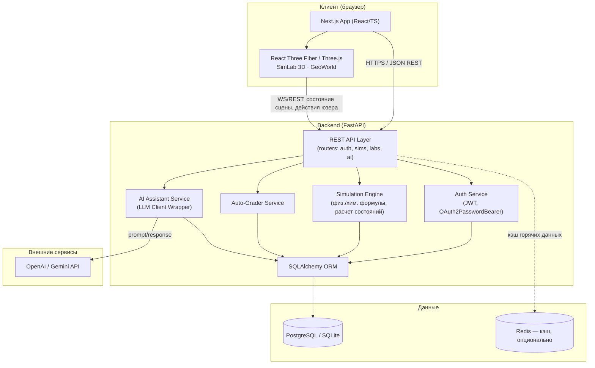
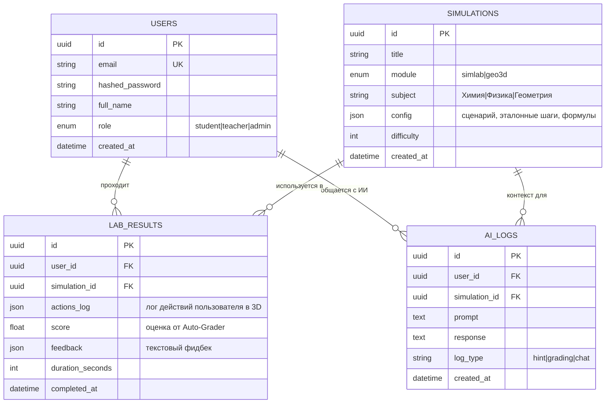

# EduMind 3D — PROJECT PLAN

Интерактивная образовательная WebGL-экосистема для школ. Кинематографичные 3D-симуляции по химии/физике и географии/геологии прямо в браузере, с ИИ-ассистентом и авто-проверкой заданий. Всё приложение — в единой темной теме (Glassmorphism).

> **Финальный скоуп MVP: только 2 модуля.** BioBody 3D (биология/анатомия)
> и стереометрия/геометрия полностью удалены из проекта. Гуманитарный блок
> никогда не входил в скоуп.

## 0. Модули MVP (финальная версия)

1. **SimLab 3D (Химия + Неорганическая физика)** — реалистичная колба
   (LatheGeometry, силуэт колбы Эрленмейера) с настоящим стеклом
   (`MeshTransmissionMaterial`: преломление, хроматическая аберрация, IOR),
   смешивание реагентов, расчет реакций (`simulation_engine.py`):
   динамическое изменение цвета раствора, светящиеся instanced-частицы
   газа, зернистые instanced-частицы осадка, неоновое Bloom-свечение при
   экзотермической реакции. Физика: идеальный газ (PV=nRT), закон
   охлаждения Ньютона, слайдеры температуры/объема, кнопка **Slow-Mo**
   (`time_scale`) для замедления процесса.
2. **GeoWorld (География и Геология)** *(технически модуль в БД/URL
   по-прежнему называется `geo3d` — переименовано только отображаемое
   название и содержание, чтобы не трогать API/роуты)* — интерактивный
   3D-глобус Земли на **настоящих спутниковых текстурах** (NASA Blue
   Marble, локально в `public/textures/`, без зависимости от интернета в
   момент урока): облака, рельеф через normal map, светящиеся тектонические
   линии, мягкое атмосферное свечение. Разрез слоев (кора → мантия →
   внешнее ядро → внутреннее ядро) через плавную прозрачность — клик по
   каждому слою запрашивает у бэкенда (`geography_engine.py`) реальные
   данные о глубине/температуре/составе.
3. **AI Lab Assistant & Auto-Grader** — анализ действий ученика в 3D;
   Auto-Grader считает **детерминированный числовой** score (порядок
   шагов — без участия LLM); AI-подсказки (плавающий стеклянный чат,
   framer-motion) покрывают ошибки в расчетах и технику безопасности.

**Визуальный слой:** процедурная студийная HDRI-подсветка через drei
`<Lightformer>` + градиентный фон (canvas-текстура, без внешнего CDN —
надежность для школ без интернета), мягкие `<ContactShadows>`, звездное
небо (`<Stars>`) для GeoWorld, пост-обработка `<Bloom>`
(`@react-three/postprocessing`). **Всё приложение** (не только 3D-сцены) —
в темной теме: Navbar/Sidebar/дашборд/auth-страницы оформлены в
Glassmorphism (`bg-white/5 backdrop-blur-xl border-white/10`) на темном
фоне `slate-950`.

---

## 1. Архитектура (Architecture Diagram)



**Принцип взаимодействия:**
1. Next.js фронтенд рендерит 3D-сцены через React Three Fiber; вся физика визуализации (анимации, цвет, частицы) — на клиенте.
2. Клиент отправляет на бэкенд **события** (например, "смешал вещество A + B при 80°C") — бэкенд не рендерит 3D, а считает **результат** (новый цвет/состояние/газ) по формулам и возвращает JSON.
3. Auto-Grader и AI Assistant анализируют лог действий пользователя (`AI_Logs` / `LabResults`) и формируют подсказки/оценку через LLM API.
4. Redis (опционально) кэширует часто запрашиваемые справочные данные (таблицы реакций, константы) — не обязателен для MVP, можно добавить позже.

---

## 2. Чек-лист разработки по дням

### ДЕНЬ 1 — Архитектура Бэкенда + БД + Auth/User System ✅ done
- [x] Инициализация репозитория: структура папок `backend/`, `frontend/`
- [x] Настройка `backend`: FastAPI app, Pydantic Settings (`.env`), CORS
- [x] Подключение SQLAlchemy + Alembic (миграции)
- [x] Конфигурация БД: PostgreSQL (prod) / SQLite (dev, по умолчанию для быстрого старта)
- [x] Модели: `User`, `Role` (student/teacher/admin)
- [x] Auth: регистрация, логин, JWT (access + refresh токены), хэш паролей (bcrypt/passlib)
- [x] Middleware: `get_current_user`, ролевой доступ (RBAC: student vs teacher)
- [x] Базовые CRUD-эндпоинты для пользователя (`/me`, `/users`)
- [x] Health-check эндпоинт (`/health`)
- [x] Настройка pytest + первые unit-тесты для auth

### ДЕНЬ 2 — Симуляции, физико-химические формулы, AI API, Auto-Grader ✅ done
- [x] Модели: `Simulation` (справочник сценариев/уроков), `LabResult`, `AI_Log`
- [x] Модуль расчетов `SimLab` (химия/физика):
  - [x] Реакции: таблица правил (реагент A + реагент B → продукт, цвет, газ, осадок, экзо/эндотермия)
  - [x] Формулы: давление/температура (идеальный газ PV=nRT), закон охлаждения Ньютона
  - [x] Поддержка Slow-Mo: расчет прогресса анимации по elapsed/duration/time_scale
- [x] Модуль расчетов `Geo3D`: формулы площади/объема для куба, сферы, конуса, цилиндра, пирамиды
- [x] Эндпоинты симуляций (`GET /simulations/`, `GET /{id}`, `POST /{id}/action`, `POST /{id}/complete`)
- [x] AI Assistant Service: async-обертка над OpenAI Chat Completions, mock-фоллбек без API-ключа
- [x] Auto-Grader: детерминированное сравнение actions_log с expected_steps → числовой score
- [x] Сохранение сессий в `LabResults`, логов диалога с ИИ в `AI_Logs`
- [x] Unit- и интеграционные тесты (31 тест, все зеленые)

### ДЕНЬ 3 — Фронтенд каркас, роутинг, UI, интеграция с бэкендом ✅ done
- [x] Инициализация Next.js 14 (App Router) + TypeScript + TailwindCSS
- [x] Структура страниц: `(auth)/login`, `(auth)/register`, `(app)/dashboard`, `(app)/simlab/[id]`, `(app)/biobody/[id]`, `(app)/geo3d/[id]`, `(app)/teacher`
- [x] Auth-flow на клиенте: JWT в localStorage (`token-storage.ts`), `AuthProvider`/`useAuth`, `ProtectedRoute` (в т.ч. ролевые ограничения для `/teacher`)
- [x] API-клиент (`lib/api.ts`): fetch-wrapper с авто-подстановкой JWT, one-shot refresh при 401, типы в `lib/types.ts`
- [x] UI-кит: Navbar, Sidebar, LessonCard, Loader (lucide-react иконки)
- [x] Дашборд ученика (список симуляций через SWR → `LessonCard`)
- [x] Дашборд учителя (список учеников → результаты конкретного ученика)
- [x] Интеграция состояния через SWR (`swr-fetcher.ts`)
- [x] `npm run build` и `tsc --noEmit` проходят без ошибок; Next.js запинен на 14.2.35 (патч critical CVE)
- [x] Ручной E2E-смоук в браузере: регистрация → авто-логин → dashboard → reload (сессия восстанавливается) → logout → ролевой редирект с `/teacher` для студента

### ДЕНЬ 4 — 3D-рендеринг (Three.js/R3F), интерактивные сцены ✅ done
- [x] `@react-three/fiber@8.18.0` + `@react-three/drei@9.122.0` + `three@0.169.0` (линейка под React 18); общий `CanvasShell` (Canvas, OrbitControls 360°, свет, тени)
- [x] **SimLab 3D**: колба + жидкость с плавным лерпом цвета, instanced-частицы газа (растут/лопаются), instanced-частицы осадка (оседают на дно), выбор реагентов → `POST /action`
  - [x] Слайдеры температуры/объема → живой расчет давления (P·V=nRT) на клиенте (`lib/simlab-formulas.ts`)
  - [x] Slow-Mo слайдер (`time_scale`) — управляет скоростью частиц и остывания (закон Ньютона)
- [x] **BioBody 3D**: реализован на примитивах — впоследствии полностью вырезан на Дне 5
- [x] **Geo3D (стереометрия)**: вращение фигур, live-расчет площади/объема — впоследствии полностью заменен на GeoWorld (география/геология) на Дне 5
- [x] Синхронизация с бэкендом: действие → `LabResult` через `/action` и `/complete`, score виден в UI
- [x] `AIAssistantChat` — плавающий виджет поверх 3D-сцен, вызывает `/api/ai/hint`

### ДЕНЬ 5 — Кинематографичный визуал, смена скоупа, полировка ✅ done
- [x] **BioBody 3D полностью удален**: `SimulationModule.BIOBODY` убран из enum (Alembic batch-миграция `e69f728bcfc2` под SQLite), удалены компонент и роут `/biobody/[id]`
- [x] **Стереометрия заменена на GeoWorld (география/геология)**: `geo3d_engine.py` (формулы куба/сферы/...) удален, вместо него `geography_engine.py` со справочником слоев Земли (кора/мантия/внешнее и внутреннее ядро: глубина, температура, состав); роутер `/action` теперь обрабатывает `explore_layer` вместо `compute_metrics`
- [x] **SimLab 3D — кинематографичный визуал**: колба на `LatheGeometry` (силуэт Эрленмейера) + drei `<MeshTransmissionMaterial>` (настоящее преломление, хроматическая аберрация, IOR 1.5), глянцевый лабораторный подиум, emissive-подсветка жидкости при экзотермической реакции, instanced-частицы газа/осадка со свечением
- [x] **GeoWorld — 3D-глобус на реальных текстурах**: NASA Blue Marble (`earth_diffuse.jpg`, `earth_normal.jpg`, `earth_clouds.png` — скачаны из `three.js` examples repo, public domain, сохранены локально в `public/textures/`, не требуют интернета на уроке); облака отдельным слоем, стилизованные светящиеся линии тектонических плит, атмосферное свечение (additive rim glow), **разрез слоев** через плавную прозрачность коры/мантии/внешнего ядра (эффект глубже — более непрозрачный), внутреннее ядро всегда ярко светится (Bloom); клик по слою → `POST /action explore_layer` → реальные данные о глубине/температуре/составе
- [x] **Общий `CanvasShell`**: градиентный фон (canvas-текстура вместо плоской заливки), процедурное HDRI-освещение через `<Lightformer>` (без внешнего CDN), `<ContactShadows>` + опциональный `<Grid>` пол (для SimLab; у GeoWorld пол выключен — планета в космосе), `<EffectComposer><Bloom/></EffectComposer>` с `bloomIntensity` per-сцена
- [x] **UI: полная темная тема + Glassmorphism** — не только 3D-сцены, а всё приложение: `globals.css`, Navbar, Sidebar, LessonCard, дашборд, teacher-страница, auth-layout, login/register — везде `bg-slate-950` + `bg-white/5 backdrop-blur-xl border-white/10`, `accent-brand` на слайдерах
- [x] **AIAssistantChat**: анимация открытия/закрытия через `framer-motion` (`AnimatePresence`), стеклянная темная панель
- [x] **Багфиксы, найденные и исправленные в реальном браузере** (не просто "написал и надеюсь"):
  - Layout: чат был `absolute` относительно всей секции (всплывал к низу страницы, а не канваса) — вынесен в отдельный `relative`-контейнер вместе с `CanvasShell`
  - `localClippingEnabled` передавался через `gl={{...}}` проп `<Canvas>` — это не конструкторный параметр `WebGLRenderer`, свойство молча игнорировалось; исправлено через `onCreated`
  - Клик по внутренним слоям Земли не работал: `stopPropagation` в обработчике коры блокировал события для мантии/ядра, лежащих глубже вдоль луча, даже когда кора почти прозрачна — переписано на накопление "самого глубокого" слоя в ref и обработку через `queueMicrotask` (один клик = один API-запрос)
  - Backend-процесс запускался без `--reload` и не подхватывал правки роутера — источник нескольких "необъяснимых" 400-к; исправлено (`--reload` теперь всегда)
  - После `next build` дев-сервер запускался поверх продакшен-`.next` → `__webpack_modules__[moduleId] is not a function`; правило — всегда чистить `.next` при переключении build↔dev
- [x] Backend: 28/28 тестов зеленые (31 → 28 после удаления 3 тестов стереометрии, добавлены тесты `geography_engine`)
- [x] Frontend: `npm run build` + `tsc --noEmit` чисто
- [x] Ручной браузерный смоук: SimLab (Bloom-свечение при реакции подтверждено визуально, формулы давления сходятся), GeoWorld (разрез слоев показывает все 4 цвета, клик по внутреннему ядру возвращает точные данные 5150–6371 км/5200–6000°C), AI-чат (открытие/закрытие с анимацией, ответ получен), полный цикл `action → complete → Оценка 100/100`
- [x] **Замер FPS — с оговоркой**: в headless/автоматизированном Chrome вкладка помечена `hidden`/`hasFocus:false`, из-за чего браузер троттлит `requestAnimationFrame` (первый замер ~29 FPS, повторный — 0 кадров за 8с). Это ограничение среды автоматизации, не показатель реального браузера пользователя. Оптимизации применены не глядя на цифры: `dpr` capped на 1.5 (было 2), `EffectComposer multisampling` 4→0, тени 1024→512, `MeshTransmissionMaterial` samples 4→2/resolution 256→128, сегменты сфер и `<Stars>` уменьшены. **Точный FPS нужно проверить в обычном браузере** (DevTools → Rendering → Frame Rendering Stats)

### День 6+ (не начато) — дальнейшая полировка
- [ ] Инструментальный замер FPS в обычном (не автоматизированном) браузере — снять оговорку выше
- [ ] E2E тесты (Playwright/Cypress): регистрация → урок → симуляция → оценка
- [ ] Профилирование бэкенда (время ответа API симуляций)
- [ ] Доступность (a11y), responsive-режим для мобильных
- [ ] Публичная landing-страница / расширенное меню (сейчас после логина сразу дашборд со списком симуляций — если нужна отдельная маркетинговая главная страница, это отдельная задача, не начата)
- [ ] Подготовка README + docker-compose для backend+db

---

## 3. Схема базы данных (Database Schema)



---

## 4. Структура API эндпоинтов (REST API Specification)

### Auth (`/api/auth`)
| Метод | Путь | Описание | Доступ |
|---|---|---|---|
| POST | `/api/auth/register` | Регистрация пользователя | Public |
| POST | `/api/auth/login` | Логин, выдача JWT | Public |
| POST | `/api/auth/refresh` | Обновление access-токена | Auth |
| GET  | `/api/auth/me` | Данные текущего пользователя | Auth |

### Users (`/api/users`)
| Метод | Путь | Описание | Доступ |
|---|---|---|---|
| GET | `/api/users/` | Список учеников (для учителя) | Teacher/Admin |
| GET | `/api/users/{id}` | Профиль пользователя | Auth |
| PATCH | `/api/users/{id}` | Обновление профиля | Owner/Admin |

### Simulations (`/api/simulations`)
| Метод | Путь | Описание | Доступ |
|---|---|---|---|
| GET | `/api/simulations/` | Список доступных симуляций (фильтр по module/subject) | Auth |
| GET | `/api/simulations/{id}` | Детали симуляции + конфиг сцены | Auth |
| POST | `/api/simulations/{id}/action` | Отправить действие пользователя (например, смешать реагенты), получить расчетный результат | Auth |
| POST | `/api/simulations/{id}/complete` | Завершить сессию, создать `LabResult` | Auth |

### Lab Results (`/api/results`)
| Метод | Путь | Описание | Доступ |
|---|---|---|---|
| GET | `/api/results/me` | Мои результаты | Auth |
| GET | `/api/results/student/{user_id}` | Результаты конкретного ученика | Teacher/Admin |
| GET | `/api/results/{id}` | Детали одного результата | Owner/Teacher |

### AI Assistant (`/api/ai`)
| Метод | Путь | Описание | Доступ |
|---|---|---|---|
| POST | `/api/ai/hint` | Получить подсказку по текущему состоянию сцены | Auth |
| POST | `/api/ai/grade` | Запросить авто-оценку по `LabResult` | Auth/System |
| GET | `/api/ai/logs/{simulation_id}` | История диалога с ИИ по симуляции | Owner/Teacher |

### Health
| Метод | Путь | Описание |
|---|---|---|
| GET | `/health` | Проверка живости сервиса |

---

## 5. Структура папок проекта (Directory Tree)

```
EduMind 3D/
├── backend/
│   ├── app/
│   │   ├── main.py                 # entrypoint FastAPI
│   │   ├── config.py                # Pydantic Settings (.env)
│   │   ├── database.py              # SQLAlchemy engine/session
│   │   ├── models/
│   │   │   ├── user.py
│   │   │   ├── simulation.py
│   │   │   ├── lab_result.py
│   │   │   └── ai_log.py
│   │   ├── schemas/                 # Pydantic-схемы (request/response)
│   │   │   ├── user.py
│   │   │   ├── simulation.py
│   │   │   ├── lab_result.py
│   │   │   └── ai.py
│   │   ├── routers/
│   │   │   ├── auth.py
│   │   │   ├── users.py
│   │   │   ├── simulations.py
│   │   │   ├── results.py
│   │   │   └── ai.py
│   │   ├── services/
│   │   │   ├── auth_service.py       # JWT, hashing
│   │   │   ├── simulation_engine.py  # физ./хим. формулы (SimLab)
│   │   │   ├── geography_engine.py   # слои Земли: глубина/температура/состав (GeoWorld)
│   │   │   ├── grader_service.py     # Auto-Grader логика
│   │   │   └── ai_service.py         # LLM client wrapper
│   │   └── core/
│   │       ├── security.py
│   │       └── deps.py               # get_current_user, ролевые проверки
│   ├── alembic/                      # миграции БД
│   ├── tests/
│   ├── requirements.txt
│   └── .env.example
│
├── frontend/
│   ├── app/
│   │   ├── layout.tsx                 # root layout (AuthProvider)
│   │   ├── page.tsx                   # redirect -> /dashboard или /login
│   │   ├── globals.css
│   │   ├── (auth)/layout.tsx          # центрированная карточка для auth-страниц
│   │   ├── (auth)/login/page.tsx
│   │   ├── (auth)/register/page.tsx
│   │   ├── (app)/layout.tsx           # ProtectedRoute + Navbar + Sidebar
│   │   ├── (app)/dashboard/page.tsx
│   │   ├── (app)/simlab/[id]/page.tsx   # 3D-канвас SimLab
│   │   ├── (app)/geo3d/[id]/page.tsx    # 3D-канвас GeoWorld
│   │   └── (app)/teacher/page.tsx
│   ├── components/
│   │   ├── ProtectedRoute.tsx
│   │   ├── ui/                        # Navbar, Sidebar, LessonCard, Loader
│   │   ├── ai/AIAssistantChat.tsx      # плавающий стеклянный чат (framer-motion)
│   │   └── scenes/
│   │       ├── CanvasShell.tsx          # Canvas + OrbitControls + Lightformer HDRI + градиент + Bloom
│   │       ├── SimLabScene.tsx          # колба (Lathe+Transmission), частицы, Slow-Mo
│   │       └── GeoWorldScene.tsx        # 3D-глобус (реальные текстуры), разрез слоев
│   ├── lib/
│   │   ├── api.ts                     # fetch-wrapper: JWT, refresh-on-401
│   │   ├── auth-context.tsx           # AuthProvider / useAuth
│   │   ├── token-storage.ts           # localStorage access/refresh токенов
│   │   ├── swr-fetcher.ts
│   │   ├── simlab-formulas.ts         # зеркало ideal_gas/newton_cooling для live-UI
│   │   └── types.ts                   # TS-типы под backend-схемы
│   ├── public/textures/               # earth_diffuse/normal/clouds.* (NASA, локально)
│   ├── tailwind.config.ts
│   └── package.json
│
├── .gitignore
├── docker-compose.yml
└── PROJECT_PLAN.md
```

---

## Итог

Дни 1–5 реализованы и проверены. Backend: auth, симуляции, физ./хим. формулы
(SimLab) + справочник слоев Земли (GeoWorld), Auto-Grader, AI-ассистент —
28/28 тестов зеленых (BioBody и стереометрия вырезаны чисто, включая
Alembic-миграцию enum). Frontend: Next.js-каркас, auth-flow, дашборды
ученика/учителя, полностью темная тема с Glassmorphism по всему приложению
(не только 3D-сцены), и два кинематографичных 3D-модуля:
- **SimLab 3D** — настоящее преломляющее стекло (`MeshTransmissionMaterial`),
  Bloom-свечение экзотермических реакций, instanced-частицы газа/осадка;
- **GeoWorld** — 3D-глобус Земли на реальных спутниковых текстурах NASA
  (локально, без интернета на уроке), разрез слоев кора→мантия→ядро с
  реальными геофизическими данными по клику.

Всё собрано (`npm run build`/`tsc` чисто) и вручную проверено в реальном
браузере, включая несколько найденных и исправленных багов (layout чата,
`localClippingEnabled`, клик через прозрачные слои, backend без `--reload`,
dev-сервер поверх стейл `.next`), и полный цикл `action → complete` →
Auto-Grader score. Замер FPS дал не полностью достоверный результат
(среда автоматизации троттлит фоновые вкладки) — оптимизации применены,
но точную цифру нужно снять на обычном браузере.

Финальный скоуп: **SimLab 3D + GeoWorld + AI Lab Assistant** — ничего лишнего.
Далее (не начато): инструментальный FPS в реальном браузере,
автоматизированные E2E-тесты, a11y/responsive, публичная landing-страница
(если нужна), README и docker-compose.


