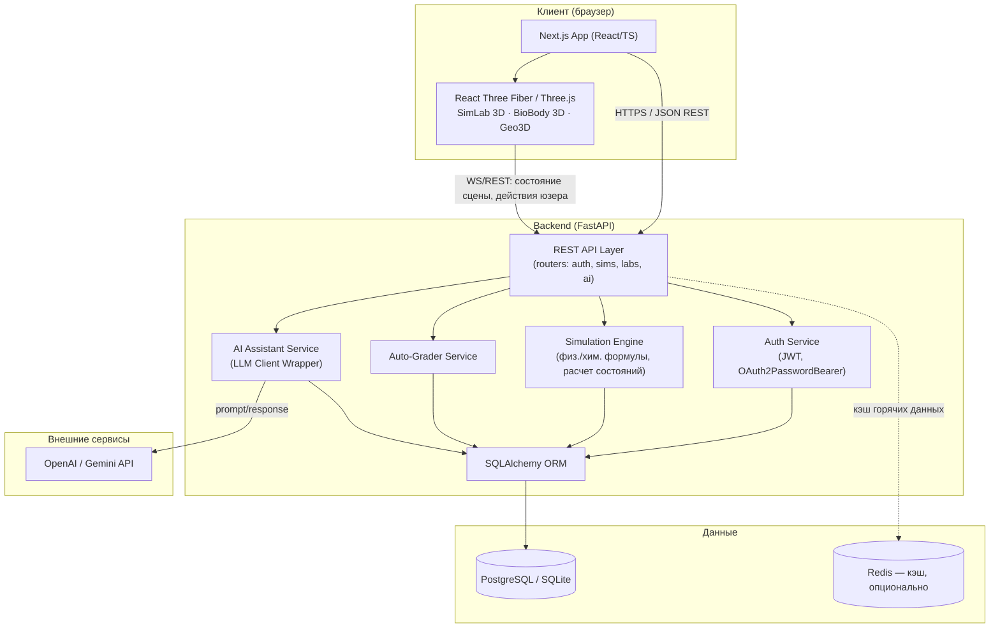
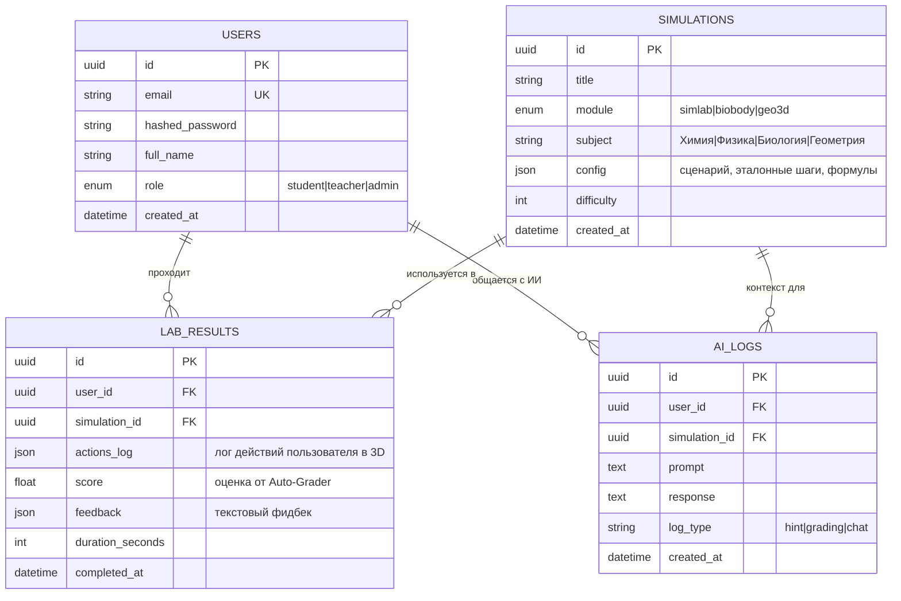

# EduMind 3D — PROJECT PLAN

Интерактивная образовательная WebGL-экосистема для школ. 3D-симуляции по химии, физике, биологии и геометрии прямо в браузере, с ИИ-ассистентом и авто-проверкой заданий.

> **Скоуп MVP: только точные и естественные науки.** Гуманитарный блок не
> входил в исходный скоуп и не планируется — фокус исключительно на физике,
> химии, биологии/анатомии и геометрии.

## 0. Модули MVP (актуальная версия)

1. **SimLab 3D (Химия и Физика)** — виртуальные колбы/пробирки, смешивание
   реагентов, расчет реакций (`simulation_engine.py`): динамическое изменение
   цвета раствора, выделение газов, **выпадение осадка (precipitate)**,
   температура реакции. Физика: идеальный газ (PV=nRT), закон охлаждения
   Ньютона, слайдеры температуры/давления, кнопка **Slow-Mo / Time Loop**
   (`time_scale`) для замедления/отмотки процесса.
2. **BioBody 3D (Биология и Анатомия)** — интерактивная 3D-модель (GLTF/OBJ),
   режим **X-Ray** как плавный переход прозрачности внешних оболочек в
   динамике (не статичный toggle), просмотр внутренних органов и систем.
3. **Geo3D (Стереометрия)** — 3D-примитивы (куб, сфера, конус, пирамида,
   цилиндр) с вращением и изменением размеров, live-расчет площади/объема.
4. **AI Lab Assistant & Auto-Grader** — анализ физико-химических действий
   ученика в 3D; Auto-Grader считает **детерминированный числовой** score
   (пропорции, температурный режим, порядок шагов — без участия LLM);
   AI-подсказки покрывают ошибки в расчетах и нарушения **техники
   безопасности** сценария.

---

## 1. Архитектура (Architecture Diagram)



**Принцип взаимодействия:**
1. Next.js фронтенд рендерит 3D-сцены через React Three Fiber; вся физика визуализации (анимации, цвет, частицы) — на клиенте.
2. Клиент отправляет на бэкенд **события** (например, "смешал вещество A + B при 80°C") — бэкенд не рендерит 3D, а считает **результат** (новый цвет/состояние/газ) по формулам и возвращает JSON.
3. Auto-Grader и AI Assistant анализируют лог действий пользователя (`AI_Logs` / `LabResults`) и формируют подсказки/оценку через LLM API.
4. Redis (опционально) кэширует часто запрашиваемые справочные данные (таблицы реакций, константы) — не обязателен для MVP, можно добавить позже.

---

## 2. Чек-лист разработки по дням

### ДЕНЬ 1 — Архитектура Бэкенда + БД + Auth/User System ✅ done
- [x] Инициализация репозитория: структура папок `backend/`, `frontend/`
- [x] Настройка `backend`: FastAPI app, Pydantic Settings (`.env`), CORS
- [x] Подключение SQLAlchemy + Alembic (миграции)
- [x] Конфигурация БД: PostgreSQL (prod) / SQLite (dev, по умолчанию для быстрого старта)
- [x] Модели: `User`, `Role` (student/teacher/admin)
- [x] Auth: регистрация, логин, JWT (access + refresh токены), хэш паролей (bcrypt/passlib)
- [x] Middleware: `get_current_user`, ролевой доступ (RBAC: student vs teacher)
- [x] Базовые CRUD-эндпоинты для пользователя (`/me`, `/users`)
- [x] Health-check эндпоинт (`/health`)
- [x] Настройка pytest + первые unit-тесты для auth

### ДЕНЬ 2 — Симуляции, физико-химические формулы, AI API, Auto-Grader ✅ done
- [x] Модели: `Simulation` (справочник сценариев/уроков), `LabResult`, `AI_Log`
- [x] Модуль расчетов `SimLab` (химия/физика):
  - [x] Реакции: таблица правил (реагент A + реагент B → продукт, цвет, газ, осадок, экзо/эндотермия)
  - [x] Формулы: давление/температура (идеальный газ PV=nRT), закон охлаждения Ньютона
  - [x] Поддержка Slow-Mo: расчет прогресса анимации по elapsed/duration/time_scale
- [x] Модуль расчетов `Geo3D`: формулы площади/объема для куба, сферы, конуса, цилиндра, пирамиды
- [x] Эндпоинты симуляций (`GET /simulations/`, `GET /{id}`, `POST /{id}/action`, `POST /{id}/complete`)
- [x] AI Assistant Service: async-обертка над OpenAI Chat Completions, mock-фоллбек без API-ключа
- [x] Auto-Grader: детерминированное сравнение actions_log с expected_steps → числовой score
- [x] Сохранение сессий в `LabResults`, логов диалога с ИИ в `AI_Logs`
- [x] Unit- и интеграционные тесты (31 тест, все зеленые)

### ДЕНЬ 3 — Фронтенд каркас, роутинг, UI, интеграция с бэкендом ✅ done
- [x] Инициализация Next.js 14 (App Router) + TypeScript + TailwindCSS
- [x] Структура страниц: `(auth)/login`, `(auth)/register`, `(app)/dashboard`, `(app)/simlab/[id]`, `(app)/biobody/[id]`, `(app)/geo3d/[id]`, `(app)/teacher`
- [x] Auth-flow на клиенте: JWT в localStorage (`token-storage.ts`), `AuthProvider`/`useAuth`, `ProtectedRoute` (в т.ч. ролевые ограничения для `/teacher`)
- [x] API-клиент (`lib/api.ts`): fetch-wrapper с авто-подстановкой JWT, one-shot refresh при 401, типы в `lib/types.ts`
- [x] UI-кит: Navbar, Sidebar, LessonCard, Loader (lucide-react иконки)
- [x] Дашборд ученика (список симуляций через SWR → `LessonCard`)
- [x] Дашборд учителя (список учеников → результаты конкретного ученика)
- [x] Интеграция состояния через SWR (`swr-fetcher.ts`)
- [x] `npm run build` и `tsc --noEmit` проходят без ошибок; Next.js запинен на 14.2.35 (патч critical CVE)
- [x] Ручной E2E-смоук в браузере: регистрация → авто-логин → dashboard → reload (сессия восстанавливается) → logout → ролевой редирект с `/teacher` для студента

### ДЕНЬ 4 — 3D-рендеринг (Three.js/R3F), интерактивные сцены ✅ done
- [x] `@react-three/fiber@8.18.0` + `@react-three/drei@9.122.0` + `three@0.169.0` (линейка под React 18); общий `CanvasShell` (Canvas, OrbitControls 360°, ручной 3-точечный свет вместо внешнего HDR — оффлайн-надежность для школ)
- [x] **SimLab 3D**: колба + жидкость с плавным лерпом цвета, instanced-частицы газа (растут/лопаются), instanced-частицы осадка (оседают на дно), выбор реагентов → `POST /action`
  - [x] Слайдеры температуры/объема → живой расчет давления (P·V=nRT) на клиенте (`lib/simlab-formulas.ts`)
  - [x] Slow-Mo слайдер (`time_scale`) — управляет скоростью частиц и остывания (закон Ньютона)
- [x] **BioBody 3D**: процедурное тело из примитивов (GLTF-ассетов в MVP нет), X-Ray — плавный lerp прозрачности "кожи" в `useFrame` (не instant-toggle), клик по органу (сердце/легкие/желудок) → инфо-попап, органы кликабельны только при включенном X-Ray
- [x] **Geo3D**: вращение всех 5 фигур через `useFrame`, живой расчет площади/объема (`lib/geo3d-formulas.ts`, зеркало backend-формул), запись шага + `/complete`
- [x] Синхронизация с бэкендом: `mix_reagents`/`compute_metrics` → `LabResult` через `/action` и `/complete`, score виден в UI
- [x] `AIAssistantChat` — плавающий виджет поверх каждой из трех 3D-сцен, вызывает `/api/ai/hint`
- [x] `npm run build` + `tsc --noEmit` чисто; ручной браузерный смоук всех трех сцен: реакция+газ, X-Ray+клик по органу, live-формулы Geo3D, AI-чат — все проверено визуально в реальном браузере

### ДЕНЬ 5 — E2E тестирование, оптимизация, полировка
- [ ] E2E тесты (Playwright/Cypress): регистрация → урок → симуляция → оценка
- [ ] Оптимизация FPS: instancing, LOD, сжатие текстур/моделей (Draco/KTX2), lazy-loading сцен
- [ ] Профилирование бэкенда (время ответа API симуляций)
- [ ] UI/UX полировка: responsive-режим, состояния загрузки/ошибок, доступность (a11y)
- [ ] Финальный багфиксинг, ревью логов ИИ на корректность подсказок
- [ ] Подготовка README + инструкция по запуску (docker-compose для backend+db)

---

## 3. Схема базы данных (Database Schema)



---

## 4. Структура API эндпоинтов (REST API Specification)

### Auth (`/api/auth`)
| Метод | Путь | Описание | Доступ |
|---|---|---|---|
| POST | `/api/auth/register` | Регистрация пользователя | Public |
| POST | `/api/auth/login` | Логин, выдача JWT | Public |
| POST | `/api/auth/refresh` | Обновление access-токена | Auth |
| GET  | `/api/auth/me` | Данные текущего пользователя | Auth |

### Users (`/api/users`)
| Метод | Путь | Описание | Доступ |
|---|---|---|---|
| GET | `/api/users/` | Список учеников (для учителя) | Teacher/Admin |
| GET | `/api/users/{id}` | Профиль пользователя | Auth |
| PATCH | `/api/users/{id}` | Обновление профиля | Owner/Admin |

### Simulations (`/api/simulations`)
| Метод | Путь | Описание | Доступ |
|---|---|---|---|
| GET | `/api/simulations/` | Список доступных симуляций (фильтр по module/subject) | Auth |
| GET | `/api/simulations/{id}` | Детали симуляции + конфиг сцены | Auth |
| POST | `/api/simulations/{id}/action` | Отправить действие пользователя (например, смешать реагенты), получить расчетный результат | Auth |
| POST | `/api/simulations/{id}/complete` | Завершить сессию, создать `LabResult` | Auth |

### Lab Results (`/api/results`)
| Метод | Путь | Описание | Доступ |
|---|---|---|---|
| GET | `/api/results/me` | Мои результаты | Auth |
| GET | `/api/results/student/{user_id}` | Результаты конкретного ученика | Teacher/Admin |
| GET | `/api/results/{id}` | Детали одного результата | Owner/Teacher |

### AI Assistant (`/api/ai`)
| Метод | Путь | Описание | Доступ |
|---|---|---|---|
| POST | `/api/ai/hint` | Получить подсказку по текущему состоянию сцены | Auth |
| POST | `/api/ai/grade` | Запросить авто-оценку по `LabResult` | Auth/System |
| GET | `/api/ai/logs/{simulation_id}` | История диалога с ИИ по симуляции | Owner/Teacher |

### Health
| Метод | Путь | Описание |
|---|---|---|
| GET | `/health` | Проверка живости сервиса |

---

## 5. Структура папок проекта (Directory Tree)

```
EduMind 3D/
├── backend/
│   ├── app/
│   │   ├── main.py                 # entrypoint FastAPI
│   │   ├── config.py                # Pydantic Settings (.env)
│   │   ├── database.py              # SQLAlchemy engine/session
│   │   ├── models/
│   │   │   ├── user.py
│   │   │   ├── simulation.py
│   │   │   ├── lab_result.py
│   │   │   └── ai_log.py
│   │   ├── schemas/                 # Pydantic-схемы (request/response)
│   │   │   ├── user.py
│   │   │   ├── simulation.py
│   │   │   ├── lab_result.py
│   │   │   └── ai.py
│   │   ├── routers/
│   │   │   ├── auth.py
│   │   │   ├── users.py
│   │   │   ├── simulations.py
│   │   │   ├── results.py
│   │   │   └── ai.py
│   │   ├── services/
│   │   │   ├── auth_service.py       # JWT, hashing
│   │   │   ├── simulation_engine.py  # физ./хим. формулы
│   │   │   ├── grader_service.py     # Auto-Grader логика
│   │   │   └── ai_service.py         # LLM client wrapper
│   │   └── core/
│   │       ├── security.py
│   │       └── deps.py               # get_current_user, ролевые проверки
│   ├── alembic/                      # миграции БД
│   ├── tests/
│   ├── requirements.txt
│   └── .env.example
│
├── frontend/
│   ├── app/
│   │   ├── layout.tsx                 # root layout (AuthProvider)
│   │   ├── page.tsx                   # redirect -> /dashboard или /login
│   │   ├── globals.css
│   │   ├── (auth)/layout.tsx          # центрированная карточка для auth-страниц
│   │   ├── (auth)/login/page.tsx
│   │   ├── (auth)/register/page.tsx
│   │   ├── (app)/layout.tsx           # ProtectedRoute + Navbar + Sidebar
│   │   ├── (app)/dashboard/page.tsx
│   │   ├── (app)/simlab/[id]/page.tsx   # 3D-канвас SimLab
│   │   ├── (app)/biobody/[id]/page.tsx  # 3D-канвас BioBody
│   │   ├── (app)/geo3d/[id]/page.tsx    # 3D-канвас Geo3D
│   │   └── (app)/teacher/page.tsx
│   ├── components/
│   │   ├── ProtectedRoute.tsx
│   │   ├── ui/                        # Navbar, Sidebar, LessonCard, Loader
│   │   ├── ai/AIAssistantChat.tsx      # плавающий чат поверх 3D-сцен
│   │   └── scenes/
│   │       ├── CanvasShell.tsx          # Canvas + OrbitControls + свет
│   │       ├── SimLabScene.tsx          # колба, частицы газа/осадка, Slow-Mo
│   │       ├── BioBodyScene.tsx         # процедурное тело + X-Ray
│   │       └── Geo3DScene.tsx           # фигуры + live-формулы
│   ├── lib/
│   │   ├── api.ts                     # fetch-wrapper: JWT, refresh-on-401
│   │   ├── auth-context.tsx           # AuthProvider / useAuth
│   │   ├── token-storage.ts           # localStorage access/refresh токенов
│   │   ├── swr-fetcher.ts
│   │   ├── simlab-formulas.ts         # зеркало ideal_gas/newton_cooling для live-UI
│   │   ├── geo3d-formulas.ts          # зеркало geo3d_engine.py для live-UI
│   │   └── types.ts                   # TS-типы под backend-схемы
│   ├── tailwind.config.ts
│   └── package.json
│
├── .gitignore
├── docker-compose.yml
└── PROJECT_PLAN.md
```

---

## Итог

Дни 1–4 реализованы и проверены. Backend: auth, симуляции, физ./хим. формулы,
Auto-Grader, AI-ассистент — 31 тест зеленых. Frontend: Next.js-каркас,
auth-flow, дашборды ученика/учителя, и три интерактивные 3D-сцены на
React Three Fiber (SimLab 3D, BioBody 3D, Geo3D) с плавающим AI-чатом —
всё собрано (`npm run build`/`tsc` чисто) и вручную проверено в браузере
(реакция+частицы газа, X-Ray+клик по органу, live-формулы Geo3D). Скоуп
подтвержден: только точные науки (SimLab 3D, BioBody 3D, Geo3D, AI Lab
Assistant). Далее — **День 5**: E2E-тесты, оптимизация FPS 3D-сцен,
полировка UI/UX, багфиксинг.
